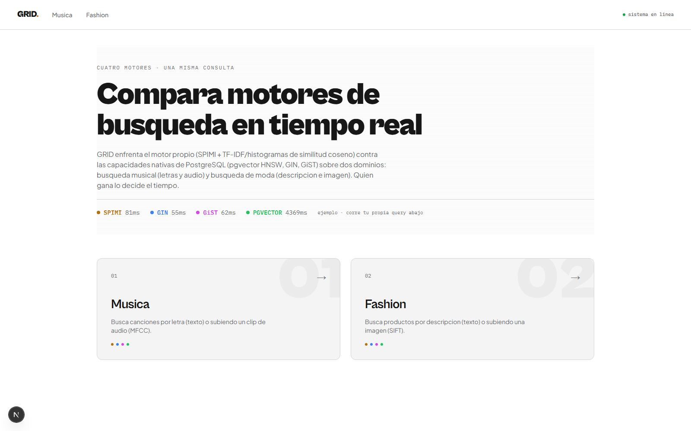
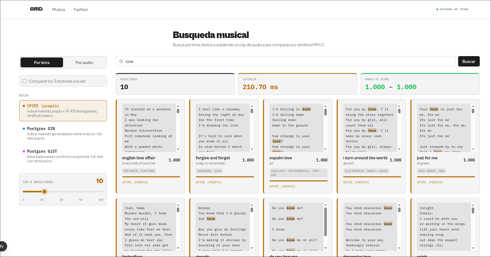
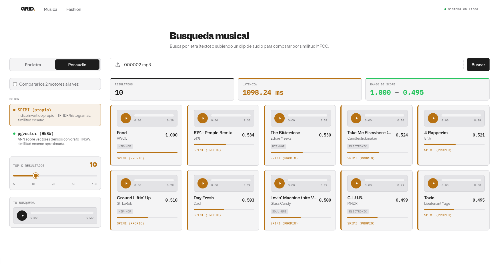
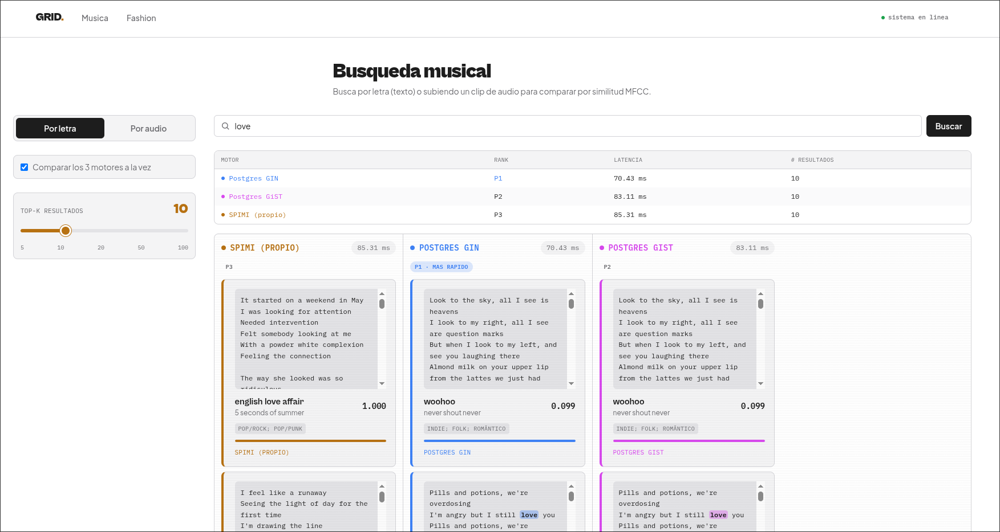
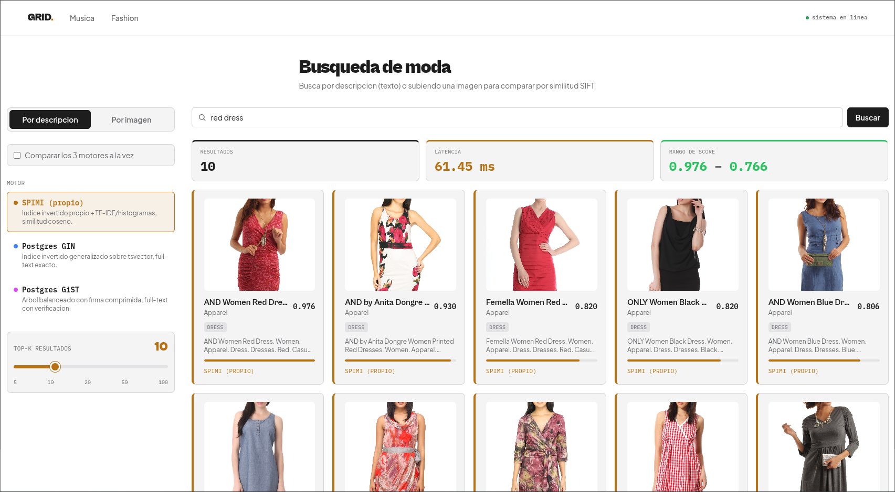
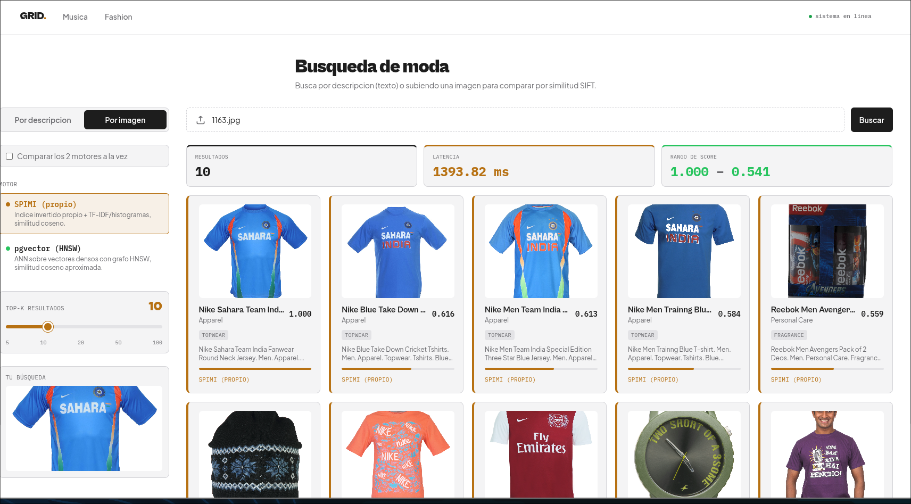

# Manual de Usuario — GRID

Guía rápida para usar el frontend. Para instalación y arranque del backend/base de datos, ver el `README.md` en la raíz del repo (sección "Setup").

---

## 1. ¿Qué es GRID?

GRID compara en tiempo real cuatro motores de recuperación de información — el motor propio (**SPIMI** + TF-IDF/histogramas de similitud coseno) contra los nativos de PostgreSQL (**GIN**, **GiST**, **pgvector/HNSW**) — sobre dos dominios:

- **Música** — buscar canciones por **letra** (texto) o subiendo un **clip de audio** para encontrar canciones acústicamente similares.
- **Fashion** — buscar productos por **descripción** (texto) o subiendo una **imagen** para encontrar productos visualmente similares.

Cada motor tiene un color fijo en toda la app (ámbar = SPIMI, azul = GIN, magenta = GiST, verde = pgvector), así se reconoce de un vistazo qué motor produjo cada resultado.

## 2. Requisitos antes de usar la interfaz

1. Backend corriendo en `http://localhost:8000` (`uvicorn src.main:app --reload`).
2. Frontend corriendo en `http://localhost:3000` (`pnpm dev` dentro de `frontend/`).
3. PostgreSQL levantado y, si se quieren resultados reales, datos ya indexados (ver `bash scripts/setup_all.sh` en el README). Sin datos indexados la interfaz sigue funcionando, pero las búsquedas devuelven 0 resultados.

El indicador **"sistema en línea"** arriba a la derecha del nav confirma en vivo que el backend y Postgres/pgvector están disponibles (llama a `/api/db/status` al cargar la página).

## 3. Navegación

Al abrir `http://localhost:3000` verás el home con dos tarjetas de entrada: **Música** y **Fashion**. El menú superior permite moverse entre ambas en cualquier momento.

## 4. El panel lateral de filtros

Tanto `/music` como `/fashion` usan el mismo layout: un panel a la izquierda con todos los controles, y el contenido (búsqueda + resultados) a la derecha. El panel lateral tiene, de arriba a abajo:

1. **Pestañas de modalidad** — texto (letra/descripción) o archivo (audio/imagen).
2. **Casilla "Comparar los N motores a la vez"** — activa el modo comparación.
3. **Selector de motor** (solo si no estás comparando) — cada opción muestra su nombre y una descripción corta de cómo funciona (SPIMI, GIN, GiST, pgvector).
4. **Slider de Top-K** — cuántos resultados pedir (5 a 100), con el valor actual grande en ámbar.
5. **"Tu búsqueda"** (solo en la pestaña de archivo, tras subir uno) — reproductor o miniatura de lo que subiste.

## 5. Búsqueda musical (`/music`)

### 5.1 Por letra

1. Pestaña **"Por letra"** (activa por defecto), elige motor en el panel lateral.
2. Escribe palabras clave (ej. `love, heartbreak, summer`) y pulsa **Buscar**.
3. Cada resultado muestra la **letra completa** en vez de un reproductor — tiene más sentido para una búsqueda por texto. Las palabras del query que hicieron match quedan **resaltadas** dentro de la letra, con el color del motor que las encontró.
4. También se muestra título, artista, género, score y el motor (con nombre legible, ej. "Postgres GIN", nunca el string crudo del backend).

### 5.2 Por audio

1. Pestaña **"Por audio"**, elige motor (SPIMI o pgvector).
2. Arrastra un archivo de audio a la zona punteada, o haz clic para elegirlo.
3. Aparece **"Tu búsqueda"** en el panel lateral con un reproductor propio (no el `<audio>` nativo del navegador) para escuchar exactamente lo que subiste: botón play/pause circular, barra de progreso clickeable y tiempo actual/duración.
4. Los resultados muestran canciones similares por MFCC, cada una con su propio reproductor igual de estilizado.

### 5.3 Comparar motores

Marca **"Comparar los N motores a la vez"** para lanzar la misma consulta contra todos los motores en paralelo. Aparece una tabla resumen (leaderboard) arriba de los resultados con motor, ranking (P1, P2...), latencia y # de resultados por motor — el más rápido queda marcado "MÁS RÁPIDO". Debajo, una columna por motor con sus propios resultados.

## 6. Búsqueda de moda (`/fashion`)

### 6.1 Por descripción

1. Pestaña **"Por descripción"**, escribe algo como `red dress, denim jacket` y pulsa **Buscar**.
2. Cada resultado muestra miniatura, nombre, categoría, subcategoría y la descripción completa del producto.

### 6.2 Por imagen

1. Pestaña **"Por imagen"**, arrastra o elige una foto de un producto.
2. "Tu búsqueda" muestra la miniatura de lo que subiste en el panel lateral.
3. Debajo, los productos visualmente más parecidos (SIFT), con barra de score relativa a la mejor coincidencia.

## 7. Cómo leer los resultados y las estadísticas

Arriba de cada lista de resultados hay tiles de estadísticas:

| Tile | Significado |
|---|---|
| Resultados | Cuántos documentos devolvió la búsqueda. |
| Latencia | Tiempo de la consulta completa (ms). |
| Rango de score | Score del mejor y del peor resultado de esa lista. |

No se muestra un "score promedio": promediar scores de motores con escalas distintas (coseno, `ts_rank`, similitud aproximada HNSW) no es una métrica comparable de forma fiable, así que se omitió a propósito.

Dentro de cada card:

| Campo | Significado |
|---|---|
| Barra de color a la izquierda / debajo del score | Identidad del motor (mismo color en toda la app). |
| Score + barra horizontal | Score del resultado y qué tan cerca está del mejor resultado de esa misma lista. |
| Motor (texto de color, abajo) | Nombre legible del motor, nunca el string crudo del backend. |

## 8. Problemas comunes

| Síntoma | Causa probable | Qué hacer |
|---|---|---|
| "0 resultados" en toda búsqueda | No hay datos indexados en Postgres | Ejecutar `bash scripts/setup_all.sh` (ver README) |
| "sistema caído" en el nav / error 503 "BD no disponible" | Postgres no está corriendo | `docker compose up -d` y esperar el healthcheck |
| Error 503 "No hay codebook persistido" | El ETL de esa modalidad no corrió | Repetir el ETL correspondiente (`etl_music.py` / `etl_fashion.py`) |
| El reproductor de audio/imagen de un resultado no carga | El archivo de media ya no existe en disco en la ruta guardada en BD | Verificar que la carpeta de datos original siga en el mismo path usado durante el ETL |

---

*Este manual cubre el flujo de usuario final. Para arquitectura interna, algoritmos y resultados experimentales, ver `INFORME.md`.*
