<!-- _class: lead -->

# Sistema Multimodal de Recuperación y Búsqueda

## Proyecto 2 — Base de Datos II · Ciclo 2026-1

Universidad de Ingeniería y Tecnología (UTEC)

Elmer Villegas · Juan Carlos Ticlia · Joseph Anderson Cose · Josué Hernández Yataco · Paulo Miranda

<!-- Integrantes inferidos de la autoría en git log — ajustar nombres/orden si hace falta -->

---

<!-- _class: section -->

# 1. Arquitectura Unificada Multimodal

---

# Un solo paradigma para texto, audio e imagen

El sistema aplica **la misma tubería de cuatro pasos** sin importar la modalidad, para poder comparar motores de forma justa sobre el mismo corpus: fragmentar el contenido, extraer sus características, reducirlas a un vocabulario finito, y construir un índice sobre ese vocabulario.

- **Fragmentar** — párrafos (texto), ventanas de tiempo (audio), regiones de la imagen
- **Extraer características** — un descriptor numérico distinto según la modalidad
- **Vocabulario finito (codebook)** — se comparte entre el motor propio y los nativos de Postgres
- **Índice invertido** — mismo motor (SPIMI) para las tres modalidades

---

<!-- _class: small -->

# Vista global del sistema

**Zona offline — procesamiento**
- Los datasets entran al pipeline ML común (Split → Extracción → Codebook → Histograma)
- El ETL persiste el índice SPIMI local **y** los vectores/tsvector en PostgreSQL

**Zona de consulta — online**
- El frontend envía la query al **API Gateway**, que decide a qué motor enrutarla
- El gateway consulta en paralelo al **motor SPIMI** y/o a **PostgreSQL**
- Ambos devuelven el mismo formato de respuesta unificada

---

# Pipeline unificado end-to-end

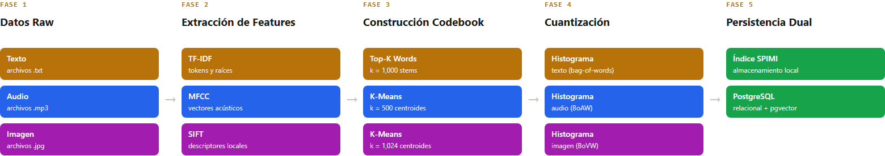

Cinco fases, la **misma estructura para las tres modalidades** — solo cambia el extractor y el tamaño del codebook (`k`) en cada fase.

---

<!-- _class: section -->

# 2. Extracción de Características por Modalidad

---

# Texto — Normalización y reducción a raíces

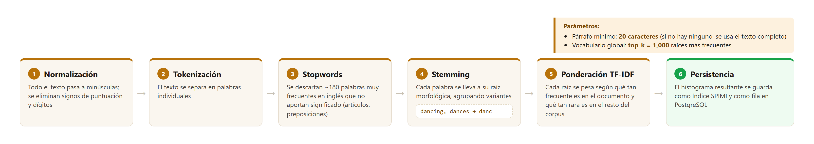

Seis pasos, del texto crudo al histograma persistido — la misma lógica de fragmentar, extraer y cuantizar que ya vimos a nivel general, aplicada a texto.

---

# Audio — Extracción de coeficientes cepstrales (MFCC)

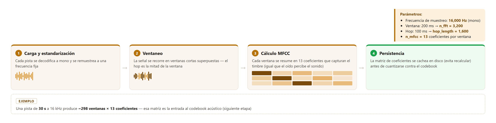

El resultado se cachea por pista, ya que el cálculo de MFCC es la etapa más costosa del pipeline de audio.

---

# Imagen — Detección de puntos clave (SIFT)

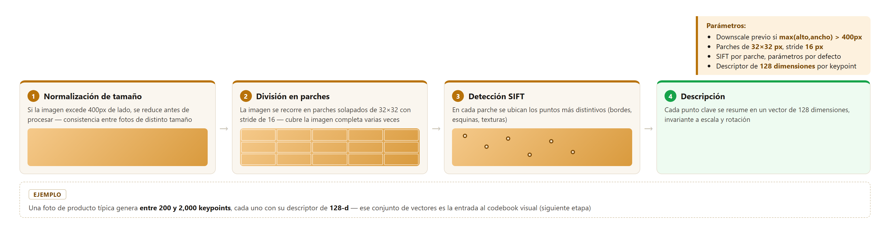

Esto permite reconocer la misma prenda o instancia visual aunque cambie el tamaño, el ángulo o la posición en la foto.

---

<!-- _class: section -->

# 3. Construcción del Codebook (Diccionario)

---

# Visual Words / Acoustic Words

La idea central: convertir descriptores locales continuos en un vocabulario **discreto y finito**, igual que un diccionario de palabras para texto.

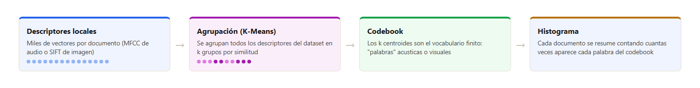

Para texto el mismo principio se aplica sin K-Means: el vocabulario son las palabras más frecuentes del corpus (por la ley de Zipf, un puñado de raíces cubre la gran mayoría de las ocurrencias).

---

# K-Means propio

Implementado desde cero para este proyecto — no usa librerías externas de clustering.

| Modalidad | Tamaño del codebook | Muestra de entrenamiento |
|---|---:|---:|
| Audio (MFCC) | 500 palabras acústicas | 50,000 descriptores |
| Imagen (SIFT) | 1,024 palabras visuales | 150,000 descriptores |

- Se entrena una sola vez por modalidad, sobre una muestra representativa del dataset completo
- Un centroide que se queda sin puntos asignados conserva su posición anterior, en vez de reiniciarse al azar — evita que el entrenamiento oscile
- Una vez entrenado, cada descriptor nuevo se asigna al centroide más cercano para construir el histograma del documento

---

<!-- _class: section -->

# 4. Implementación del Índice Invertido (SPIMI)

---

# SPIMI — Single-Pass In-Memory Indexing

Resuelve indexar un corpus **más grande que la RAM disponible**, sin necesitar tenerlo todo en memoria a la vez.

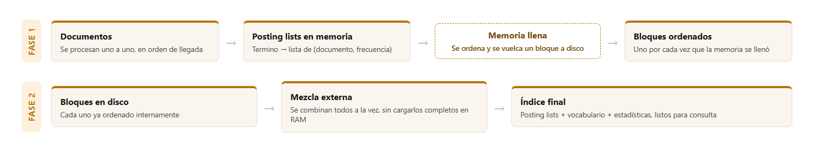

---

# Consulta sobre el índice invertido

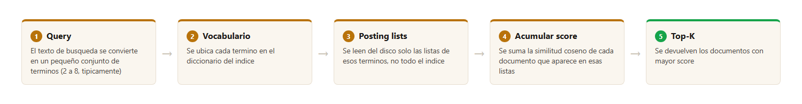

Solo se leen del disco las posting lists de los términos de la query — nunca el vocabulario completo. El mismo mecanismo sirve para texto, audio e imagen: un "codeword" visual o acústico se busca exactamente igual que una palabra.

---

<!-- _class: section -->

# 5. Motores Nativos en PostgreSQL

---

# Full-text search — GIN vs GiST

Postgres mantiene una columna de búsqueda de texto que se actualiza sola cada vez que cambia el contenido — no hace falta código adicional para mantenerla sincronizada.

| Índice | Cómo busca | Mejor para |
|---|---|---|
| **GIN** | Índice invertido clásico: palabra → lista de documentos | Lectura muy rápida, escritura más costosa |
| **GiST** | Árbol balanceado con firmas aproximadas | Escritura más barata, lectura con una verificación extra |

Ambos devuelven un score de relevancia (qué tan bien calza el texto con la consulta) y permiten ordenar los resultados por ese score.

---

<!-- _class: small -->

# Búsqueda vectorial — pgvector + HNSW

**HNSW** (Hierarchical Navigable Small World): grafo organizado en capas que permite encontrar vecinos cercanos sin comparar contra todo el dataset.

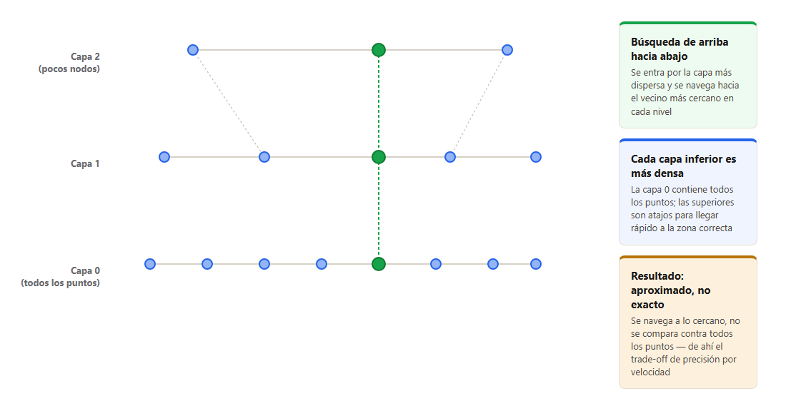

Postgres expone esto como un operador nativo de distancia sobre los mismos vectores del pipeline.

---

<!-- _class: section -->

# 6. Datasets y Preprocesamiento

---

<!-- _class: small -->

# Fuentes de datos

Spotify Songs Lyrics
~40,000 letras, solo en inglés

FMA-(small, Large)
~40,000 pistas de audio, 8 géneros

Fashion Product Images
~44,000 productos con imagen + descripción

| App | Modalidades | Dataset | Auth |
|---|---|---|---|
| **App · Música** | Texto + Audio | Spotify Songs Lyrics (Kaggle) + FMA-small | Kaggle token + HTTPS |
| **App · Fashion** | Texto + Imagen | Fashion Product Images (Kaggle) | Kaggle token |

- **Letras**: se conservan solo las que están en inglés, para que el vocabulario de stopwords y el stemmer sean consistentes en todo el corpus
- **Fashion**: la descripción de cada producto combina su nombre con los atributos estructurados del catálogo (categoría, color, uso, temporada, etc.)

---

# Preprocesamiento y muestreo

- **Metadatos**: cada pista de audio se enriquece con su título, artista y género antes de retornarse como respuesta al frontend
- **Pareo de modalidades**: en Fashion, cada producto tiene imagen y descripción, por lo que es un documento bimodal. En música, letras y audio vienen de fuentes distintas, así que cada canción es texto-solo o audio-solo, nunca ambas
- **Muestreo para K-Means**: en vez de usar todos los descriptores del dataset (inviable en memoria), se toma una muestra uniforme representativa — grande y aleatoria, pero reproducible

---

<!-- _class: section -->

# 7. Evaluación Experimental y Resultados

---

# Metodología

- **Cargas**: N = 10,000 / 20,000 / 30,000 / 40,000 documentos (subset por symlinks sobre el corpus real, `benchmark/run_all.sh`)
- **Métricas**: latencia (avg / p50 / p95 ms), throughput (qps), memoria pico (RSS), tamaño en disco del índice
- **Precisión normalizada (recall_norm@10)**: divide entre min(K, relevantes) en vez de entre el total de resultados devueltos — evita que un motor parezca "perfecto" solo por devolver pocos resultados (caso GIN/GiST con AND estricto)
- **Consultas**: 100 queries por combinación `(motor, modalidad, N)`, las mismas para los 4 motores, k=10
- **Orden de análisis**: se sigue el flujo del pipeline — primero búsqueda por **texto** (los 2 datasets), luego **audio**, luego **imagen**

---

<!-- _class: small -->

# Resultados — Búsqueda por Texto (Letras + Descripción)

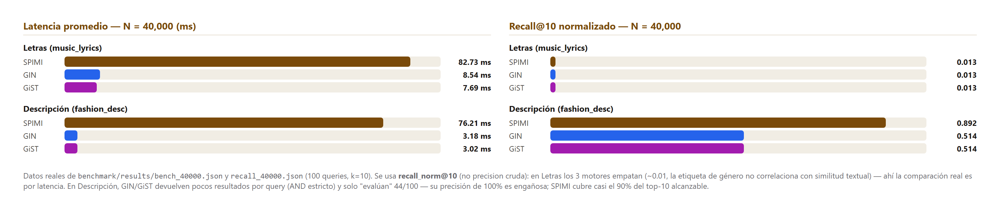

En Letras los 3 motores empatan en recall_norm (~0.01) — la etiqueta de género no correlaciona con similitud textual, la comparación real es por latencia (GIN/GiST ~10x más rápidos). En Descripción, SPIMI cubre casi el 90% del top-10 alcanzable; GIN/GiST devuelven pocos resultados por query (AND estricto) y su precisión aparente de 100% es engañosa.

---

# Resultados — Búsqueda por Audio (Música)

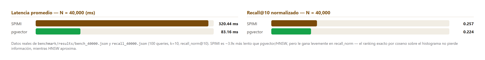

Motores comparados: SPIMI pgvector (HNSW) — clip de audio como query, similitud coseno sobre el codebook acústico. SPIMI es ~3.9x más lento pero le gana levemente en recall_norm — el ranking exacto por coseno no pierde información, HNSW aproxima.

---

# Resultados — Búsqueda por Imagen (Fashion)

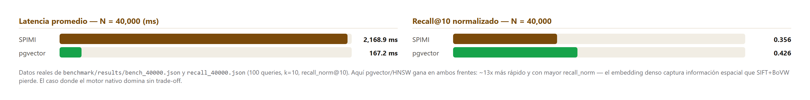

Motores comparados: SPIMI pgvector (HNSW) — foto de producto como query, similitud coseno sobre el codebook visual. Aquí pgvector gana en ambos frentes: ~13x más rápido y con mayor recall_norm — el embedding denso captura información espacial que SIFT+BoVW pierde.

---

# Dimensionalidad y mitigaciones

**Análisis de dimensionalidad** (analítico, no depende del benchmark):

- Dimensiones: texto **1,000**, audio **500**, imagen **1,024** — histogramas muy dispersos (típicamente 50-200 componentes no-cero)
- Mitigaciones aplicadas: cuantización a k codewords, coseno + normalización L2, poda IDF de términos ubicuos, subsampling estratificado para K-Means, HNSW aproximado en lugar de KNN exacto

---

<!-- _class: section -->

# 8. Análisis de Trade-offs y Conclusiones

---

<!-- _class: small -->

# Simplicidad (SPIMI) vs. Sofisticación (Postgres nativo)

| | SPIMI (propio) | pgvector HNSW | GIN / GiST |
|---|---|---|---|
| Memoria en query | Baja (stream desde disco) | Alta (grafo en `shared_buffers`) | Intermedia (buffers/WAL de Postgres) |
| I/O | Muchos `seeks` por término | Sin seeks per-query | Gestionado por Postgres |
| Exactitud | Exacto (coseno TF-IDF) | Aproximado (`ef_search` ajustable) | Exacto (full-text) |
| Mejor caso | Corpus grande, RAM limitada | Baja latencia, corpus grande | Full-text clásico |

A N=40,000, los motores nativos siempre ganan en velocidad (4x a 24x según modalidad). Pero en recall_norm@10: en Letras los 3 empatan; en Descripción y Audio **SPIMI gana** (ranking exacto no pierde información); en Imagen **pgvector gana en ambos frentes** — ver sección de evaluación (slide 7).

---

# Limitaciones del modelo Bag-of-Visual-Words

- **SIFT + BoVW** captura **textura y gradientes locales**, no "objeto" — fuerte para encontrar la misma prenda exacta, débil para retrieval semántico por categoría
- Sistemas modernos usan features **CNN (ResNet, CLIP)** para semántica real — subir `k` en K-Means no cierra esa brecha, habría que cambiar el extractor
- **K-Means artesanal** (implementado desde cero) es más lento que librerías optimizadas como FAISS — decisión consciente: el enunciado exige un motor propio construido desde cero
- Música: Spotify (letras) y FMA (audio) son fuentes distintas → ninguna canción queda indexada en ambas modalidades a la vez (simplificación honesta, no falsa bimodalidad)

---

<!-- _class: section -->

# 9. Aplicaciones Implementadas (Demo)

---

# App 2 · Búsqueda Musical Inteligente

**Modalidad primaria**: Audio + Texto

- Buscar canciones **por letra** (full-text: SPIMI GIN GiST)
- Buscar canciones **por similitud acústica** subiendo un clip de audio (SPIMI pgvector, sobre histogramas MFCC)
- Frontend **GRID**: modo comparación lado a lado de hasta 3-4 motores con la misma query, leaderboard de latencia/ranking, letra resaltada en las palabras que hicieron match, reproductor de audio propio para escuchar el resultado

---

# App 4 · Recomendación Multimodal (Fashion)

**Modalidad primaria**: Imagen + Descripción

- Buscar productos **por descripción** (texto: SPIMI GIN GiST)
- Buscar productos **visualmente similares** subiendo una foto (SPIMI pgvector, sobre histogramas SIFT)
- Cada resultado muestra miniatura, categoría, subcategoría y descripción completa del producto
- Mismo frontend GRID, misma identidad de color por motor, mismo modo de comparación

---

<!-- _class: lead -->

# Gracias

**Sistema Multimodal de Recuperación y Búsqueda**
Proyecto 2 — Base de Datos II · UTEC
