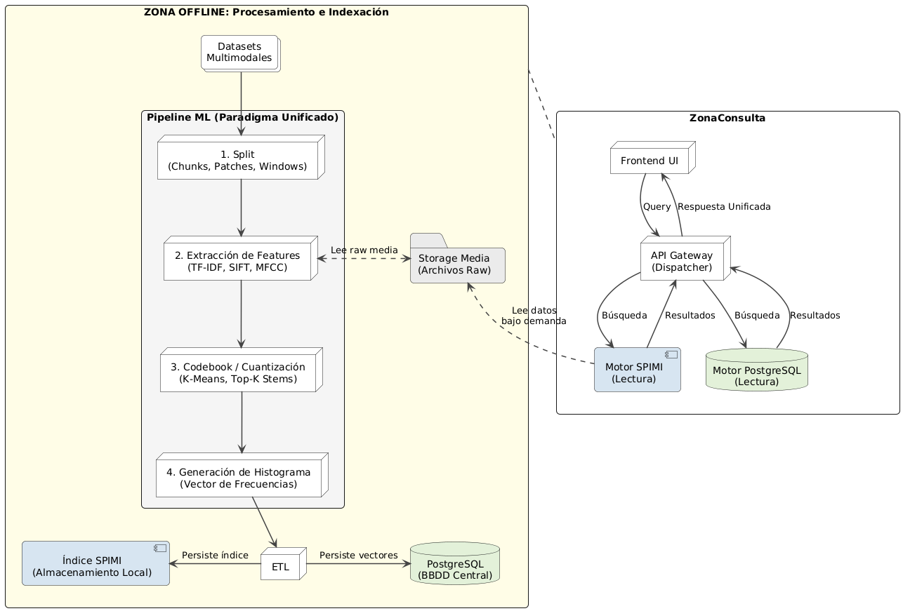
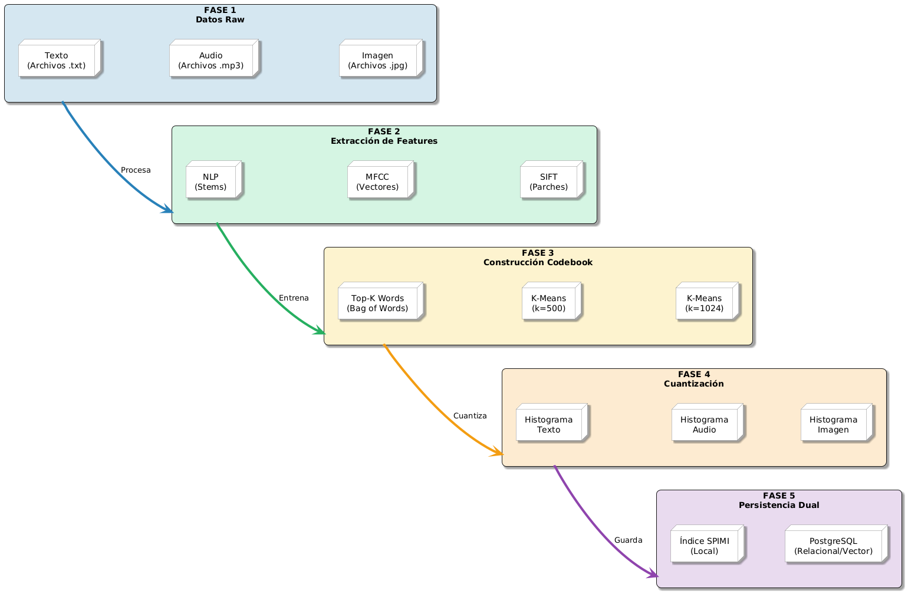
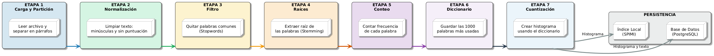
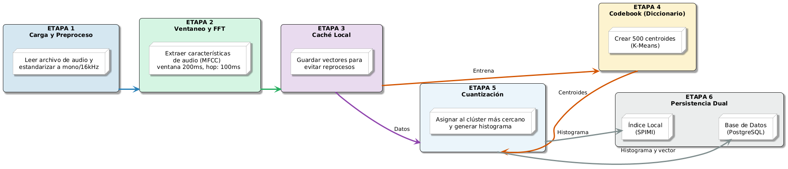
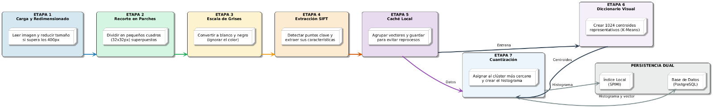

<!-- _class: lead -->

# Sistema Multimodal de Recuperación y Búsqueda

## Proyecto 2 — Base de Datos II · Ciclo 2026-1

Universidad de Ingeniería y Tecnología (UTEC)

Elmer Villegas · Juan Carlos Ticlia · Joseph Anderson Cose · Josué Hernández Yataco · Paulo Miranda

<!-- Integrantes inferidos de la autoría en git log — ajustar nombres/orden si hace falta -->

---

<!-- _class: section -->

# 1. Arquitectura Unificada Multimodal

---

# Un solo paradigma para texto, audio e imagen

El sistema aplica **la misma tubería de 4 pasos** sin importar la modalidad, para poder comparar motores de forma justa sobre el mismo corpus:

```
Split (fragmentar) → Extraction (features) → Codebook (cuantizar) → Inverted Index
```

- **Split** — párrafos (texto), ventanas deslizantes (audio), parches/keypoints (imagen)
- **Extraction** — TF-IDF, MFCC, SIFT según modalidad
- **Codebook** — vocabulario finito compartido: top-K stems / K-Means acústico / K-Means visual
- **Inverted Index** — histograma de "codewords" por documento, mismo motor SPIMI para las tres modalidades

---

# Vista global del sistema



---

# Pipeline unificado end-to-end



---

# Decisiones arquitectónicas clave

- **Un mismo histograma discreto** para las tres modalidades → mismo índice invertido, misma métrica coseno
- **Persistencia triple por documento**: histograma JSONB (auditoría), vector denso `vector(k)` (pgvector), columna `tsvector` generada (GIN/GiST)
- **Router en el backend, no SQL desde el cliente** — el "parser" es un despachador `(motor, modalidad) → función`; las 4 rutas devuelven el mismo dict `{id, score, engine, latency_ms, ...}`
- **Codebooks compartidos** entre SPIMI y pgvector — ven exactamente el mismo histograma, así la única variable que cambia es el motor

---

<!-- _class: section -->

# 2. Extracción de Características por Modalidad

---

# Texto — Tokenización + Porter Stemmer

```
lowercase(texto) → strip(puntuación, dígitos) → split(whitespace)
  → remover stopwords (NLTK inglés, ~180) → stem (Porter)
```

- Salida: `dict[stem, tf]` por chunk (párrafo)
- **TF-IDF**: `w(t,d) = log_tf(t,d) · idf(t)`, con `log_tf = 1 + log10(tf)` si `tf > 0`
- Filtrado a inglés vía el campo `language` del dataset — las stopwords/stemmer de NLTK están entrenados en inglés



---

# Audio — MFCC (Mel-Frequency Cepstral Coefficients)

- `librosa.load(sr=22050, mono=True)` → `librosa.feature.mfcc(n_mfcc=13, hop_length=256, n_fft=512)`
- Cada pista de 30s produce una matriz `(T, 13)` con `T ≈ 3000` frames
- Cacheo en `.npy` por pista (`feature_cache.py`) — la extracción es la etapa más costosa, se evita recalcular en corridas siguientes



---

# Imagen — SIFT (Scale-Invariant Feature Transform)

- `cv2.SIFT_create().detectAndCompute()` → descriptores locales de **128 dimensiones**
- Entre 200 y 2,000 keypoints por imagen, según textura/complejidad visual
- Detecta puntos clave invariantes a escala y rotación — útil para encontrar la misma prenda/instancia visual



---

<!-- _class: section -->

# 3. Construcción del Codebook (Diccionario)

---

# Visual Words / Acoustic Words

La idea central: convertir descriptores locales continuos en un vocabulario **discreto y finito**, igual que un diccionario de palabras para texto.

- **Texto**: se seleccionan las **k = 1,000** stems más frecuentes de todo el corpus (por Zipf, ~1000 stems cubren >90% de las ocurrencias)
- **Audio / Imagen**: K-Means agrupa todos los descriptores locales (MFCC / SIFT) de todo el dataset → cada centroide es una **"palabra acústica"** o **"palabra visual"**

```
Extracción → Agrupación (K-Means) → k centroides = codebook
Documento → histograma de conteo de codewords (bag-of-words / BoVW / BoAW)
```

---

# K-Means propio (`KClustering`)

| Modalidad | k (centroides) | Vectores de entrenamiento (muestreo) |
|---|---:|---:|
| Audio (MFCC) | 500 | 50,000 |
| Imagen (SIFT) | 1,024 | 150,000 |

- Inicialización gaussiana, asignación por batch (`batch_size=100,000`), tolerancia `1e-6`, `max_iter=100`
- Clusters vacíos conservan su centroide anterior en vez de reinicializarse (evita oscilación)
- Regla operativa: `max_samples ≥ 100·k` — evidencia estadística mínima por centroide
- **Cuantización**: cada descriptor local se asigna al centroide más cercano (distancia euclidiana) → histograma de conteos: `a_0000...a_0499` (audio), `v_0000...v_1023` (imagen)

---

<!-- _class: section -->

# 4. Implementación del Índice Invertido (SPIMI)

---

# SPIMI — Single-Pass In-Memory Indexing

Resuelve indexar un corpus **más grande que la RAM disponible**, en dos fases:

**Fase 1 — Inversión por bloques**
```
para cada (doc_id, term_freqs):
    para cada (term, tf): posting_list[term].append((doc_id, tf))
    si posting_bytes_acumulados >= block_size: volcar bloque a disco y limpiar memoria
```

**Fase 2 — Merge externo**
- K-way merge con **min-heap** `(term, block_idx)` sobre todos los bloques
- Produce: `final.postings` (binario), `vocab.json` (`term → offset, df`), `meta.json` (stats + normas)

---

# Consulta sobre el índice invertido

```
1. Cargar vocab.json en memoria
2. Por cada termino q en la query:
     si q ∈ vocab: fseek(offset), fread(bytes) → posting list de q
     acumular score TF-IDF por doc_id
3. Normalizar por ‖q‖·‖d_i‖ (cache en meta.json)
4. Devolver top-K
```

- Solo se itera sobre los **términos de la query** (típicamente 2-8), nunca sobre el vocabulario completo
- Se instrumentan contadores `io_seeks` e `io_read_bytes` por consulta — permite medir el costo real de disco
- El mismo motor (`InvertedIndex.search_topk`) sirve para texto, audio e imagen: un codeword (`a_0037`, `v_0512`) funciona como una palabra cualquiera

---

<!-- _class: section -->

# 5. Motores Nativos en PostgreSQL

---

# Full-text search — GIN vs GiST

Columnas `tsvector` **generadas** automáticamente, sin triggers:

```sql
lyrics_tsv tsvector GENERATED ALWAYS AS
    (to_tsvector('english', coalesce(lyrics_text, ''))) STORED;
```

| Índice | Estructura | Escritura | Lectura |
|---|---|---|---|
| **GIN** | B+Tree lexema → posting list compacta | Costosa (mitigable con `gin_pending_list_limit`) | Óptima para `@@ plainto_tsquery` |
| **GiST** | Árbol balanceado, firma comprimida (bloom) | Barata (`log N`) | Con falsos positivos → re-verificación |

Consulta: `ts_rank(tsv, plainto_tsquery('english', :query))`, ordenado por score descendente.

---

# Búsqueda vectorial — pgvector + HNSW

- **HNSW** (Hierarchical Navigable Small World): grafo multinivel para **ANN** (Approximate Nearest Neighbor)
- Índices creados sobre los embeddings densos ya cuantizados: letras (1000), audio (500), descripciones (1000), imagen (1024)
- Operador `<=>` (distancia coseno) directo en SQL:

```sql
SELECT *, 1.0 - (audio_emb <=> :query_vec) AS score
FROM songs
ORDER BY audio_emb <=> :query_vec
LIMIT :k;
```

- Trade-off: **aproximado** (calidad ajustable vía `ef_search`) a cambio de `O(log N)` esperado, vs. KNN exacto `O(N·k)`

---

<!-- _class: section -->

# 6. Datasets y Preprocesamiento

---

# Fuentes de datos

| App | Modalidades | Dataset | Volumen | Auth |
|---|---|---|---|---|
| **App 2 · Música** | Texto + Audio | Spotify Songs Lyrics (Kaggle) + FMA-small | ~40,000 letras EN + ~8,000 pistas MP3 | Kaggle token + HTTPS |
| **App 4 · Fashion** | Texto + Imagen | Fashion Product Images (Kaggle) | ~44,000 productos con imagen + descripción | Kaggle token |

- **Letras**: filtradas a inglés por el campo `language` del CSV — mantiene coherente el pipeline de stopwords/stemming
- **Fashion**: descriptor compuesto de `productDisplayName + gender + masterCategory + subCategory + articleType + baseColour + usage + season`

---

# Preprocesamiento y muestreo

- **Metadatos de FMA**: extraídos de `fma_metadata.zip` (`tracks.csv`) → `stem,title,artist,genre`
- **Pareo por `stem`**: en Fashion, imagen y descripción comparten el mismo número → cada producto es un documento bimodal. En música, Spotify (texto) y FMA (audio) usan esquemas de nombre distintos → cada canción es texto-solo o audio-solo, nunca ambas
- **Muestreo para K-Means** (`aggregate_for_kmeans`): lee cabeceras `.npy` vía `mmap_mode="r"`, sortea `max_samples` índices **uniformemente sobre el pool completo de descriptores** (no por archivo) — respeta la distribución real de textura/timbre. Semilla fija (`seed=42`) para reproducibilidad

---

<!-- _class: section -->

# 7. Evaluación Experimental y Resultados

---

# Metodología

- **Cargas**: N = 1,000 / 10,000 / 100,000 documentos (submuestreo estratificado del corpus real)
- **Métricas**: latencia (avg / p50 / p95 ms), throughput (`1000 / avg_ms` qps), **Recall@10** (relevancia derivada de género/categoría/subcategoría), memoria pico (RSS), tamaño en disco del índice
- **Instrumentación**: `scripts/bench_full.py`, `scripts/compute_recall.py`, `scripts/bench_and_report.sh`
- **Consultas**: 100 queries por combinación `(motor, modalidad, N)`, las mismas para los 4 motores

---

# Latencia y Throughput — Música / Letras

<div class="pending">

📊 Pendiente de corrida final de benchmarks — tabla y gráfico se completan con `scripts/bench_full.py` sobre el corpus real ya indexado (ver metodología, slide anterior).

</div>

| N docs | SPIMI | GIN | GiST | pgvector |
|---|---:|---:|---:|---:|
| 1,000 | — | — | — | — |
| 10,000 | — | — | — | — |
| 100,000 | — | — | — | — |

---

# Latencia y Throughput — Música / Audio, Fashion / Descripción e Imagen

<div class="pending">

📊 Mismas métricas (avg/p50/p95 ms, QPS) pendientes para las 3 combinaciones restantes de `(app, modalidad)`. Estructura de tabla idéntica a la slide anterior.

</div>

---

# Recall@10 y análisis de dimensionalidad

<div class="pending">

📊 Recall@10 por motor y por carga (N) — pendiente de `scripts/compute_recall.py`.

</div>

**Lo que sí sabemos de la dimensionalidad** (analítico, no depende del benchmark):

- Dimensiones: texto **1,000**, audio **500**, imagen **1,024** — histogramas muy dispersos (típicamente 50-200 componentes no-cero)
- Mitigaciones aplicadas: cuantización a k codewords, coseno + normalización L2, poda IDF de términos ubicuos, subsampling estratificado para K-Means, HNSW aproximado en lugar de KNN exacto

---

<!-- _class: section -->

# 8. Análisis de Trade-offs y Conclusiones

---

# Simplicidad (SPIMI) vs. Sofisticación (Postgres nativo)

| | **SPIMI (propio)** | **pgvector HNSW** | **GIN / GiST** |
|---|---|---|---|
| Memoria en query | Baja (stream desde disco) | Alta (grafo en `shared_buffers`) | Intermedia (buffers/WAL de Postgres) |
| I/O | Muchos `seeks` por término | Sin seeks per-query | Gestionado por Postgres |
| Exactitud | Exacto (coseno TF-IDF) | Aproximado (`ef_search` ajustable) | Exacto (full-text) |
| Mejor caso | Corpus grande, RAM limitada | Baja latencia, corpus grande | Full-text clásico |

<div class="pending">📊 Cifras concretas de qué motor gana en qué régimen — pendientes de la sección de evaluación (slide 7).</div>

---

# Limitaciones del modelo Bag-of-Visual-Words

- **SIFT + BoVW** captura **textura y gradientes locales**, no "objeto" — fuerte para encontrar la misma prenda exacta, débil para retrieval semántico por categoría
- Sistemas modernos usan features **CNN (ResNet, CLIP)** para semántica real — subir `k` en K-Means no cierra esa brecha, habría que cambiar el extractor
- **K-Means artesanal** (implementado desde cero) es más lento que librerías optimizadas como FAISS — decisión consciente: el enunciado exige un motor propio construido desde cero
- Música: Spotify (letras) y FMA (audio) son fuentes distintas → ninguna canción queda indexada en ambas modalidades a la vez (simplificación honesta, no falsa bimodalidad)

---

<!-- _class: section -->

# 9. Aplicaciones Implementadas (Demo)

---

# App 2 · Búsqueda Musical Inteligente

**Modalidad primaria**: Audio + Texto

- Buscar canciones **por letra** (full-text: SPIMI / GIN / GiST)
- Buscar canciones **por similitud acústica** subiendo un clip de audio (SPIMI / pgvector, sobre histogramas MFCC)
- Frontend **GRID**: modo comparación lado a lado de hasta 3-4 motores con la misma query, leaderboard de latencia/ranking, letra resaltada en las palabras que hicieron match, reproductor de audio propio para escuchar el resultado

---

# App 4 · Recomendación Multimodal (Fashion)

**Modalidad primaria**: Imagen + Descripción

- Buscar productos **por descripción** (texto: SPIMI / GIN / GiST)
- Buscar productos **visualmente similares** subiendo una foto (SPIMI / pgvector, sobre histogramas SIFT)
- Cada resultado muestra miniatura, categoría, subcategoría y descripción completa del producto
- Mismo frontend GRID, misma identidad de color por motor, mismo modo de comparación

---

<!-- _class: lead -->

# Gracias

**Sistema Multimodal de Recuperación y Búsqueda**
Proyecto 2 — Base de Datos II · UTEC
